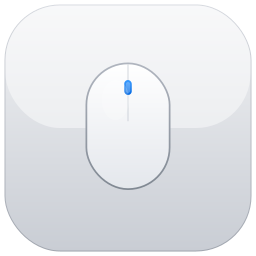

<div align="center">

<a id="한국어"></a>



# MouseCraft

**서드파티 마우스를 macOS 네이티브처럼**

트랙패드 같은 부드러운 스크롤, 버튼 리맵, 제스처를 모든 마우스에. 개인정보 최우선 — 텔레메트리 없음, 네트워크 없음, 완전 오프라인.

[](https://github.com/jinhyuk9714/MouseCraft/releases/latest/download/MouseCraft.dmg)

[릴리스](https://github.com/jinhyuk9714/MouseCraft/releases) · [이슈](https://github.com/jinhyuk9714/MouseCraft/issues)

한국어 | [English](#english)

</div>

---

## 기능

### 부드러운 스크롤
CVDisplayLink 기반 픽셀 보간 스크롤. 프레임 단위 동기화로 Apple 트랙패드와 같은 느낌. 뚝뚝 끊기는 라인 스크롤은 이제 끝.

### 버튼 리맵
사이드 버튼(Button 4/5)을 키보드 단축키로 매핑. 뒤로 가기, 앞으로 가기, 복사, 붙여넣기 등.

### 마우스 제스처
사이드 버튼을 누른 채 드래그하여 시스템 동작 실행 — Mission Control, App Expose, 데스크톱 전환.

### 앱별 프로필
앱마다 스크롤, 리맵, 제스처 설정을 따로 지정. 앱에 맞는 최적의 설정.

### 디바이스별 프로필
연결된 마우스를 HID로 자동 감지. 마우스마다 개별 설정 가능.

### 가져오기 / 내보내기
모든 설정을 JSON으로 백업 및 복원. 기기 간 손쉬운 이동.

---

## 설치

### 다운로드
[Releases](https://github.com/jinhyuk9714/MouseCraft/releases/latest) 페이지에서 최신 **MouseCraft.dmg**를 받으세요. DMG를 열고 MouseCraft를 응용 프로그램 폴더로 드래그하면 끝.

릴리스에는 다음 아티팩트가 함께 제공됩니다:
- `MouseCraft.dmg` (기본 배포)
- `MouseCraft.zip` (대체 배포)
- `SHA256SUMS.txt` (체크섬 검증용)

릴리스 자동화는 GitHub Actions 기준으로 `v*` 태그 푸시 시 자동 실행되며, `workflow_dispatch`로 수동 실행도 가능합니다.

### 소스에서 빌드
macOS 13.0 이상, Xcode 15 이상, [XcodeGen](https://github.com/yonaskolb/XcodeGen) (`brew install xcodegen`) 필요.

```bash
make gen   # Xcode 프로젝트 생성
make run   # 빌드 후 실행
make release package   # Release + DMG/ZIP/SHA256 생성
```

선택적으로 서명된 DMG를 노타리제이션하려면:

```bash
make notarize TEAM_ID=XXXXX NOTARIZE_KEYCHAIN_PROFILE=my-profile
```

첫 실행 시 **손쉬운 사용(Accessibility)** 권한을 허용해 주세요.

---

## 릴리스 검증 체크리스트

릴리스 전/후 빠르게 확인할 수 있는 최소 점검 항목입니다.

- [ ] `make release package` 빌드 성공
- [ ] 생성된 `MouseCraft.dmg` 열기 및 `MouseCraft.app` 포함 확인
- [ ] DMG에서 Applications로 드래그 후 실행 확인
- [ ] 첫 실행 시 Accessibility 권한 요청/허용 확인
- [ ] 메뉴 바 아이콘 표시 및 기본 스크롤 동작 확인
- [ ] `SHA256SUMS.txt` 생성 및 체크섬 검증 확인

---

## macOS 호환성

| macOS 버전 | 지원 여부 |
|------------|----------|
| macOS 13 Ventura | 지원 |
| macOS 14 Sonoma | 지원 |
| macOS 15 Sequoia | 지원 |
| macOS 16 Tahoe | 지원 |

---

## 권한

MouseCraft는 다음 시스템 권한이 필요합니다:

- **손쉬운 사용(Accessibility)** — CGEventTap으로 마우스 이벤트를 가로채고 수정하기 위해 필요

그게 전부입니다. 네트워크 접근 없음, 파일 접근 없음, 분석 없음. 이 앱은 네트워크 호출을 **단 한 번도** 하지 않습니다.

---

## 제거 방법

1. 메뉴 바에서 MouseCraft 종료
2. 응용 프로그램에서 MouseCraft.app 삭제
3. 설정도 지우려면: `defaults delete com.jinhyuk9714.MouseCraft`

---

## 기여하기

- **버그 제보** — [이슈 등록](https://github.com/jinhyuk9714/MouseCraft/issues)
- **코드 기여** — Pull Request 환영합니다

---

## 라이선스

Copyright 2026 MouseCraft contributors. All rights reserved.

---

<div align="center">

<a id="english"></a>


# MouseCraft

**Make Your Third-Party Mouse Feel Native on macOS**

A lightweight menu-bar utility that brings trackpad-like smooth scrolling, button remapping, and gesture support to any mouse. Privacy-first — no telemetry, no network calls, fully offline.

[](https://github.com/jinhyuk9714/MouseCraft/releases/latest/download/MouseCraft.dmg)

[Releases](https://github.com/jinhyuk9714/MouseCraft/releases) · [Issues](https://github.com/jinhyuk9714/MouseCraft/issues)

[한국어](#한국어) | English

</div>

---

## Features

### Smooth Scrolling
Pixel-interpolated, frame-synced scrolling powered by CVDisplayLink. Feels like an Apple trackpad — no more janky line-by-line jumps.

### Button Remap
Map side buttons (Button 4/5) to useful keyboard shortcuts: Back, Forward, Copy, Paste, and more.

### Mouse Gestures
Hold a side button and drag to trigger system actions — Mission Control, App Expose, switch desktops.

### Per-App Profiles
Override scroll, remap, and gesture settings for specific applications. Different apps, different configs.

### Per-Device Profiles
Auto-detects connected mice via HID. Each mouse can have its own settings.

### Import / Export
Back up and restore all settings as JSON. Easy migration between machines.

---

## Installation

### Download
Grab the latest **MouseCraft.dmg** from the [Releases](https://github.com/jinhyuk9714/MouseCraft/releases/latest) page. Open the DMG and drag MouseCraft to Applications.

Release assets include:
- `MouseCraft.dmg` (primary distribution)
- `MouseCraft.zip` (alternate distribution)
- `SHA256SUMS.txt` (integrity verification)

Release automation runs on GitHub Actions for `v*` tag pushes, and also supports manual `workflow_dispatch` runs.

### Build from Source
Requires macOS 13.0+, Xcode 15+, and [XcodeGen](https://github.com/yonaskolb/XcodeGen) (`brew install xcodegen`).

```bash
make gen   # Generate Xcode project
make run   # Build and launch
make release package   # Build Release + DMG/ZIP/SHA256
```

To notarize a signed DMG (optional):

```bash
make notarize TEAM_ID=XXXXX NOTARIZE_KEYCHAIN_PROFILE=my-profile
```

On first launch, grant **Accessibility** permission when prompted.

---

## Release Validation Checklist

Minimum checks to run before/after each release:

- [ ] `make release package` succeeds
- [ ] Open generated `MouseCraft.dmg` and verify `MouseCraft.app` is included
- [ ] Drag app to Applications and confirm it launches
- [ ] Accessibility permission prompt appears and can be granted on first launch
- [ ] Menu bar icon appears and basic scrolling behavior works
- [ ] `SHA256SUMS.txt` is generated and checksum verification passes

---

## macOS Compatibility

| macOS Version | Status |
|---------------|--------|
| macOS 13 Ventura | Supported |
| macOS 14 Sonoma | Supported |
| macOS 15 Sequoia | Supported |
| macOS 16 Tahoe | Supported |

---

## Permissions

MouseCraft requires one system permission:

- **Accessibility** — to intercept and modify mouse events via CGEventTap

That's it. No network access, no file access, no analytics. The app makes **zero** network calls.

---

## Uninstallation

1. Quit MouseCraft from the menu bar
2. Delete MouseCraft.app from Applications
3. Optionally remove settings: `defaults delete com.jinhyuk9714.MouseCraft`

---

## How to Contribute

- **Report bugs** — [Open an issue](https://github.com/jinhyuk9714/MouseCraft/issues)
- **Submit code** — Pull requests are welcome

---

## License

Copyright 2026 MouseCraft contributors. All rights reserved.
